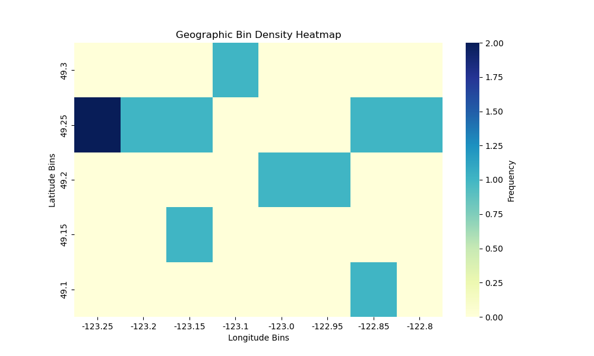

# latlonghelper

A package for cleaning and utilizing geospatial data. Allows the use of geospatial
data to help create summarizations such as distance calculations or rudimentary
visualizations via latitude–longitude binning.

Functions included:

- `LatLongDistance`: calculates the distance (in kilometres) between two geographic points given their latitude and longitude coordinates.
- `LatLongBinning`: bins latitude and longitude into different groups to aid in grouping or for use in `PlotBinnedLatLong`.
- `PlotBinnedLatLong`: visualizes binned geographic coordinates on a heatmap.

`LatLongDistance` is a common function found in many packages such as [GeoPy](https://geopy.readthedocs.io/en/stable/) and [Haversine](https://pypi.org/project/haversine/). However, binning and plotting such binned latitudes and longitudes does not currently exist. Current methods to bin require the use of multiple `Pandas` functions to do so. We aim to create a simplification of the binning and their plot without the user's having to rely on multiple uses and transformation on their part.

## What does “binning” latitude and longitude mean?

Binning latitude and longitude refers to **grouping nearby geographic points into
fixed-size grid cells**.

For example, with a grid size of `0.05°`, all points whose latitudes fall between
49.25 and 49.30 and longitudes between −123.20 and −123.15 would be assigned to the
same bin. This is useful for:

- aggregating spatial data
- counting observations in geographic regions
- creating density-style visualizations (e.g., heatmaps)
- reducing noise in very precise GPS data

## Example output

Below is an example heatmap produced by `PlotBinnedLatLong`, showing the spatial
density of binned latitude–longitude points.



## Usage example

```python
from latlonghelper.lat_long_binning import LatLongBinning
from latlonghelper.lat_long_distance import LatLongDistance
from latlonghelper.plot_binned_lat_long import PlotBinnedLatLong
import matplotlib.pyplot as plt

# Example coordinates (Vancouver area)
latitudes = [49.2606, 49.2827, 49.2685]
longitudes = [-123.2460, -123.1207, -123.1686]

# Bin coordinates
binned = []
for lat, lon in zip(latitudes, longitudes):
    binned.append(LatLongBinning(lat, lon, 0.05, 0.05))

# Plot heatmap
ax = PlotBinnedLatLong(binned)
plt.show()

# Distance example
distance = LatLongDistance(49.2606, -123.2460, 49.2827, -123.1207)
print(distance)
```
More detailed examples and tutorials are available on the documentation website.


## Documentation

Full documentation, including API references and examples, is available at:

👉 **https://UBC-MDS.github.io/latlonghelper/**

## Installation

### Prerequisites
- Python 3.8+
- `pip`

### Install from source (recommended)

Clone the repository and install the package in editable mode:

```bash
git clone https://github.com/UBC-MDS/latlonghelper
cd latlonghelper
```

### Create a conda environment

If you are using conda, you can create the development environment using:

```bash
conda env create -f environment.yml
conda activate latlonghelper-env
pip install -e .
```

## To run the tests

You can run the tests for this package using `pytest`. First, install the testing dependencies:

```bash
pip install -e ".[dev]"
```

Then, run the tests with:
```
pytest
```
To view the test coverage, run the following command:
```
pytest --cov=src/latlonghelper
```


## Dependencies

The following Python packages are required:
Runtime dependencies:
- pandas
- matplotlib
- seaborn

Development and testing dependencies:
- pytest
- pytest-cov

## Build, Preview, and Deploy the Documentation
1. Build and preview the documentation.
```bash
quartodoc build
quarto preview
```
To update the documentation website.
```bash
quarto publish gh-pages
```

## Contributing

Interested in contributing? Please see the [CONTRIBUTING.md](CONTRIBUTING.md) file.
This project is released with a [Code of Conduct](CONDUCT.md), and by contributing you agree to abide by its terms.

## License

It is licensed under the terms of the MIT license.

## Contributors

`latlonghelper` was created by Paul Raadnui, Ashifa Hassam and Amar Gill.

## Credits

`latlonghelper` was created with [`cookiecutter`](https://cookiecutter.readthedocs.io/en/latest/) and the `py-pkgs-cookiecutter` [template](https://github.com/py-pkgs/py-pkgs-cookiecutter).
